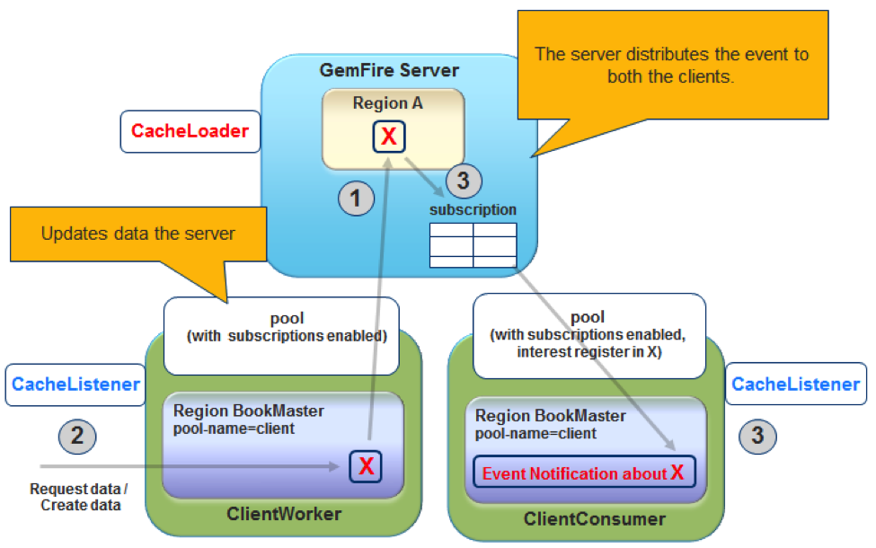
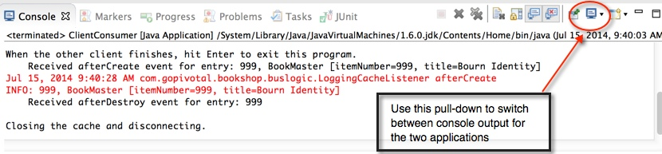

= Handling Events on the Client

== Introduction

In this lab, you will gain hands-on experience working with event handling in a GemFire client cache. In addition, you will gain experience writing a continuous query, which will give you a chance to blend OQL concepts with event processing concepts.

.Concepts you will gain experience with:
. Writing and registering a cache listener
. Registering interest in events related to certain keys
. Writing a continuous query event handler
. Submitting a continuous query

_Estimated completion time:_ 40 minutes

== Instructions

This lab is broken into two key sections. The first will involve writing and registering a cache listener. The second section will focus on using a continuous query.

=== Using a CacheListener

In this section, you will be writing and registering a cache listener attached to your client cache. To understand this part of the lab, let's outline the components that will be involved.

This solution is made up of two components:

. One worker client that retrieves and adds data in its cache
. One consumer client, which receives events from the cache server

The consumer client registers interest in some or all keys in the data region. The worker client updates its cache, and the updates are automatically forwarded to the cache server. The server forwards to the consumer only those events in which the consumer has registered interest.

[.thumb]

The consumer client has an asynchronous listener that reports local cache activity to standard out, so you can see what is happening.  Note that while the ClientWorker could receive similar events, it hasn't registered interest or configured a CacheListener so events will only be sent to the ClientConsumer.

=== Implementing a CacheListener

First, you will implement a CacheListener that will log all _create_ events. Perform the following steps:

. (`TODO-01`) Open the `clientConsumerCache.xml` file and modify the pool definition to ensure that subscriptions are enabled.

. (`TODO-02`) Locate the Book region definition and modify the region configuration to register this `LoggingCacheListener` class as a cache listener.

. (`TODO-03`) Add a _parameter_ element to pass a _filename_ property to the listener (path to a destination log file).

. Open the `LoggingCacheListener` class in the `io.pivotal.bookshop.buslogic` package (under `src/main/java`).  Notice that this class extends the `CacheListenerAdapter` class, which means that it doesn't have to implement all the methods defined by the `CacheListener` interface. This way, you only have to implement (override) the methods you are interested in for the events you want to log.

. (`TODO-04a`) Locate the `init()` method and implement the functionality to extract a property named _filename_ to a String. Then, use this value to call `initializeLogger()` to set up the logger to point to this file.

. (`TODO-04b`) Locate the `afterCreate()` method. Implement this method to log an `info` type message using the logger class attribute. In the log message, include both the key and new value.  Optionally, implement the other methods defined by the `CacheListener` to log additional events of interest (ex when an entry is updated or deleted).
+
TIP: Refer to the http://gemfire-90-javadocs.docs.pivotal.io/org/apache/geode/cache/CacheListener.html[JavaDocs for the `CacheListener` interface^] as well as the http://gemfire-90-javadocs.docs.pivotal.io/org/apache/geode/cache/EntryEvent.html[`EntryEvent` interface^] to determine the correct methods to invoke.

=== Registering Interest in ClientConsumer

Registering interest is simply a matter of obtaining a reference the appropriate region and invoking `registerInterest()` with the desired key or keys.

(`TODO-05`) Open the `ClientConsumer` class (in the `io.pivotal.bookshop.buslogic` package) and locate the line marked with the `TODO` item. Make the appropriate call to the `Book` region instance to register interest in entries with key `999`.

=== Start the Back-End

As in previous labs that focus on some client capability, we'll use the `server-bootstrap` module to start up a backend.

. Start the server-side processes using the `server-bootstrap` `start.sh` script (`start.bat` for Windows) inside the folder `cluster`:
+
----
cd server-bootstrap/cluster
./start.sh
----

. Next, run the gradle task 'seedRegions' to seed the regions with some data
+
----
cd server-bootstrap
gradle seedRegions
----

=== Running ClientWorker and ClientConsumer

In order to test the behavior you just implemented, it will be necessary to run both the ClientConsumer and ClientWorker in the following way.

. Run the `ClientConsumer` by either locating the class in the Package Explorer or in an editor tab. Right mouse click on the file or in the editor and select Run As -> Java Application. You will see output to the console indicating when the application has started and is ready for the other application to run.

. Next, run the `ClientWorker` by either locating the class in the Package Explorer or in an editor tab. Right mouse click on the file or in the editor and select Run As -> Java Application. This application will run to a certain point. You should see the following in the console output.
+
----
Connecting to the distributed system and creating the cache.
Note the other client's region listener in response to these gets.
Press Enter to continue.
----
+
Place your cursor in the console and press Enter. At this point, the program will continue with inserting and then destroying an entry with key 999.

. Switch back to the console for `ClientConsumer`. Refer to the illustration below to see how this is done.
+
[.thumb]

+
On the `ClientConsumer` console output, you should see entries that indicate that an entry was inserted per the logger. The exact output may differ from the above but should be based on how you wrote the logging message in your `LoggingCacheListener`.

=== Using a Continuous Query

In this next section, you will be combining your understanding of event processing with the prior experience gained with OQL style queries. This will involve implementing a CQListener to handle Continuous Query events and writing the necessary code to register the listener for a specific query.

. (`TODO-06`) Open the `SimpleCQListener` class and implement the code of the `onEvent()` method. Write code to print out the various values of the `CqEvent` object that is passed in.

. Next, open the `CQClient` class and locate the `registerCq()` method. Perform the following steps to set up and register the continuous query.

.. (`TODO-07`) Use the pool instance to get a `QueryService` instance

.. (`TODO-08`) Use the `QueryService` to create a `CqAttributes` instance, registering the `SimpleCQListener` class created in the prior step.

.. (`TODO-09`) Write a query to trigger an event when a `BookOrder` is created having a totalPrice greater than $100.

.. (`TODO-10`) Using the CqAttributes you created and the query you wrote, create a new `CqQuery` and then execute it. If you decide to execute with initial results, capture the results and iterate over them, printing out the orders.

. Finally, test out your implementation:

.. Start by running the `CQClient` class. Right mouse click on the file or in the editor and select `Run As -> Java Application`. This application will run to a certain point. You should see the following in the console output.
+
----
Made new CQ Service
Press enter to end
----

.. Next, locate the `DataProducer` class and run using a similar approach as the prior step. You will see the following output.
+
----
Press enter to populate an order over $100
----
+
Place your cursor in the console and hit `Enter`. This will cause the `DataProducer` to insert an order for $100, which should trigger the `CQListener`. As a result, you should see the console switch back to the CQClient app and display whatever output you defined when implementing the `onEvent()` method of the `SimpleCQListener` class.

.. Use the technique you used above in _Running ClientWorker and ClientConsumer_ to switch back to the `DataProducer` program that is still running. Place your cursor in the console area again and hit `Enter`. This will insert a BookOrder for a total price less that $100. Therefore, you should see no additional output from the `SimpleCQListener`.

.. At this point, the `DataProducer` app has terminated. Switch back to the console for the `CQClient`. First verify no additional output was generated. Then, place your cursor in the console area and hit `Enter` to cause this application to end.

Congratulations! You have completed this lab.
