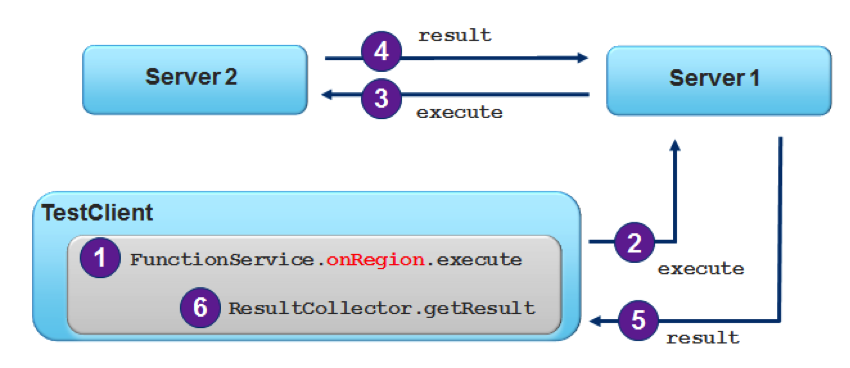

= Client Function Execution

== Introduction

In this lab, you will gain hands-on experience working with executing server-side functions from a GemFire client cache. In the prior lab, you gained experience writing and registering and testing a function that provides generic summation capabilities. For this lab, that function has already been created and registered on the server. You task in this lab is to set up the client with the necessary configuration and programming to enable the client to call this function and process the result.

The basic execution flow is illustrated below.

[.thumb]

.What you will learn
. How to execute functions on the server
. How to process results from execution

_Estimated completion time_: 30 minutes

== Enabling PDX Serialization

`cd` to the `client-functions` module.

Let's begin by making modifications necessary to enable our client to perform PDX Serialization.

. (`TODO-01`) Open the `clientCache.xml` file and add the necessary configuration to enable PDX Serialization using the `ReflectionBasedAutoSerializer`.  On the client side, make sure that you do _not_ request read serialized.

. (`TODO-02`) In the same XML file and in the PDX configuration, place additional configuration to define the appropriate classes to serialize. These will be `BookOrder` and `BookOrderItem`.

== Implementing a Custom `ResultCollector`

In this section, you will be implementing a custom `ResultCollector`. The purpose of this custom result collector is to take all the sum values sent by each member executing the function and provide a final sum representing the aggregate sum over the specified field for all data in all members hosting the partitioned region.

. (`TODO-03`) Open the `SummingResultCollector` class in the `io.pivotal.bookshop.buslogic` package. You will need to add a class field to hold the results. If necessary, open the `GenericSummingFunction` class and take note of the type used to send results.  The objective is to have one final sum amount to return to the caller once all results have been returned from the members executing the function. Define the variable and initialize it.

. (`TODO-04`) Implement the `addResult()` method to accumulate the sum.

. (`TODO-05`) Implement the `clearResults()` method.

. (`TODO-06`) Finally, implement `getResults()`.  Recall that this is the method used to provide the final result back to the caller.

== Writing a Client to Execute the Function

In this section, you will be writing the necessary client code to execute a function that has already been registered on the server;  you will also leverage the `ResultCollector` you just implemented.

. (`TODO-07`) Open the `SummingTests` test class. Locate the `shouldComputeTotalForAllOrders()` method and add code that defines the Function execution. To do this, you will define an `onRegion()` type function call on the `BookOrder` region and you will be passing an argument in to perform the sum over the field named `totalPrice`, and use the custom `ResultCollector` called `SummingResultCollector`.
+
Also in this step, add a call to execute the function by name (see the `GenericSumFunction.getId()` method implementation. This call returns a `ResultCollector`, which you should assign to a variable so you can use it in the next step.

. (`TODO-08`) With the result collector, call the method to get the results. This result should be a single object. Refer to the `SummingResultCollector` to see what type is returned and assign it to a variable of that type. Assert that the result returned is equal to the amount `93.95`.
+
NOTE: Due to typical rounding errors that can happen with `Float` and such, you may want to create a BigDecimal to compare to using a technique like this: `new BigDecimal("93.95")`.

== Running the Test

In this section, you will be running the test code you just finished writing to verify correct implementation of both the execution part as well as the result collection.

. `cd` into the `cluster` folder

. start a locator and two servers with the command:
+
----
gfsh run --file=start.gf
----

. Run the `OrderLoader` to populate the `BookOrder` region

. (`TODO-09`) Finally, run the one test inside `SummingTests` and make sure the test passes.

Congratulations! You've completed this lab.
