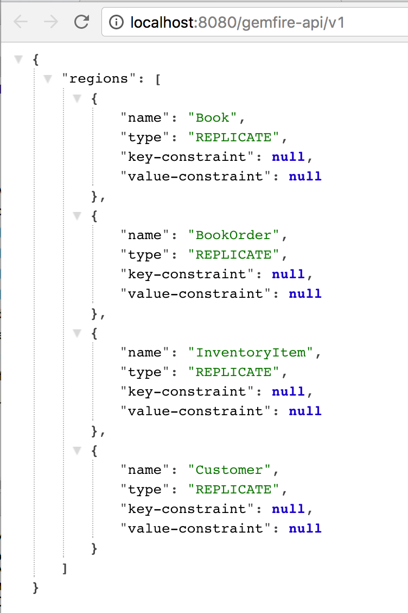
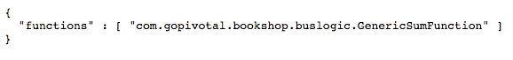

= Understanding REST Support in GemFire

== Introduction

In this lab, you will gain hands-on experience working the REST support in GemFire.

.What you will gain experience with:
. Basic configuration process for enabling REST support in GemFire
. Familiarity with the SwaggerUI as a way to understand what you can do with the REST interface
. Use Spring's `RestTemplate` to interact with the REST service

_Estimated completion time:_ 30 minutes

== Configuring REST Support

In this first section, you will perform the basic configuration steps necessary to fully enable REST support in GemFire.

. (`TODO-01`) Locate and open the `cluster.xml` file under the `cluster` folder. Add the necessary configuration to enable PDX Serialization.  Additionally configure PDX such that the server will _not_ de-serialize objects when fetching and returning them.

. (`TODO-02`) `cd` into the folder `cluster` and launch gfsh

. Start one locator process using the gfsh `start locator` command.

. Start one server process. For the server, be sure to add the appropriate configuration items to enable REST support.  Also, configure the REST service to listen on HTTP port `8080`.
+
There are two ways to accomplish this:

.. by setting the appropriate properties in the gemfire.properties file (see the http://gemfire.docs.pivotal.io/geode/reference/topics/gemfire_properties.html[gemfire properties reference^])
.. by using gfsh command flags.  Invoke `help start server`, and look for the command flags named `start-rest-api` and `http-service-port`.  Consider also setting the `http-service-bind-address` to `localhost` for this exercise.
+
NOTE: The cluster xml configuration references a GemFire function.  This means you'll need to set the `--classpath` flag so that the server process can load the function class.  Alternatively, you can deploy the function separately using the gfsh `deploy` command.

. Run the `OrderLoader` class in the `io.pivotal.bookshop.buslogic` package in `src/main/java` folder. This will populate the `BookOrder` region with a few entries.

. (`TODO-03`) Finally, verify that you have correctly set up the REST support by opening a browser to the following URL: `http://localhost:8080/gemfire-api/v1[^]`. If you have correctly configured REST support, you should see something like the following.
+
[.thumb]
.Using browser to verify REST service is properly configured

== Using the Swagger UI

In this next section, with the Swagger UI that is provided as part of the GemFire REST support. This part of the lab won't involve any work with the IDE.

. To begin, open your browser to the URL: `http://localhost:8080/gemfire-api/docs[^]`. This is the starting point for the UI.

. Click on the `functions`, `queries` and `region` links to see the REST calls that can be made for each. Notice, for example, that you can get a list of all functions by using the call to `/v1/functions`. You can also try this call out by clicking the _Try it out!_ button. Note the actual URL, which may be missing the hostname component. Also notice the pattern for how the Swagger UI displays the URL and what the actual full URL is. You will need to make use of this in future tasks.

. Using the example provided by Swagger, see if you can formulate a URL call to obtain a list of functions deployed and type that into the browser. You should see something like the following.
+
[.thumb]
.Sample return result from proper call to list functions

. Take a little time to experiment with the various interfaces related to queries and regions. See if you can perform the following tasks - both from the Swagger UI and directly from the browser (or using `curl` if you have it installed):

.. List all entries in the `BookOrder` region

.. Fetch the entry from the `BookOrder` region having key `17699`

.. Perform an ad-hoc query to select entries from the `BookOrder` region having an `orderNumber` value of `17699`

== Using the Spring REST Template

In this final section, actually create a REST client using the Spring `RestTemplate` class to aid in building the request and performing the marshalling between JSON and Java object.

. (`TODO-04`) Open the `RestClientTest` class in the `io.pivotal.bookshop.tests` package under `src/test/java` folder. Define the URL that will be used to make the request using the `BASE_URL` static String as a starting point. Keep in mind you want to use the URI template format to allow for parametrizing such elements as the key.

. (`TODO-05`) Issue a call to the `RestTemplate` to return the object given the URL you defined and passing the key `17699` as the parameter.  Feel free to consult the https://docs.spring.io/spring/docs/current/javadoc-api/org/springframework/web/client/RestTemplate.html[API reference^].  Don't forget to also specify what class to return for the object. Assign the result to the `order` variable.

. (`TODO-06`) Run the test. Did it complete successfully? If not, why not?

. If your test did not work, you may be wondering what caused an error. Because of all the help that you get from the Spring `RestTemplate`, it's actually not that easy to see what's happening at the HTTP transport level in terms of requests and responses when you exercise the application. For debugging or monitoring HTTP traffic, Eclipse ships with a built-in tool that can be of great value: the TCP/IP Monitor. To open this tool, which is just an Eclipse View, press `Ctrl+3` (MacOS: `Command+3`) and type 'tcp' in the resulting popup window; then press Enter to open the TCP/IP Monitor View. Click the small arrow pointing downwards and choose _properties_.
+
[.thumb]
.The _properties_ menu entry of the TCP/IP Monitor view
image::images/monitor-properties.png[]
+
Choose _Add..._ to add a new monitor. As local monitoring port, enter 8081 (this port is probably unused). As host name, enter _localhost_ and as port enter 8080 since this is the port that Tomcat is running on. Press OK and then press _Start_ to start the newly defined monitor.
+
TIP: Don't forget to start the monitor after adding it! The most common error at this point is to forget to start the monitor.

. (`TODO-07`) Return to the `RestClientTest` class in the STS and locate the BASE_URL definition. Change the port from `8080` to `8081` so that the TCP/IP monitor you just configured can intercept the requests. Re-run the test and observe the result. You'll need to expand the TCP/IP tab (by double-clicking on it). You should be able to observe that the proper entry came back as indicated by the response body.

. Return to the JUnit out put screen and observe in the Failure Trace the message being reported. Notice that the expected form of a Data object doesn't match the form being supplied by the JSON object being returned by the server.

. (`TODO-08`) Apply the jackson library's `@JsonFormat` annotation to the `orderDate` field in order to instruct the converter to properly parse the date being provided by the JSON object.  Provide the same formatting annotation to the `shipDate` field.

. (`TODO-09`) Re-run the test. It should now pass. Take a moment to consider what has just happened. You submitted a REST request to the server via the `RestTemplate` but you did it via a very typical method call. The data returned from the server was a JSON object (as verified by the TCP/IP monitor). However, the `RestTemplate` performed a conversion with the assistance of some well-placed formatting annotations on the domain object. What you received was a fully populated `BookOrder` object that we were able to assert had the proper order number.

Congratulations! You have completed this lab.
