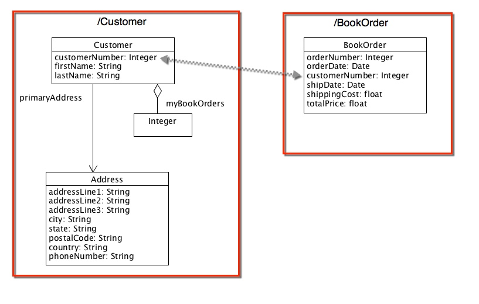

= GemFire OQL Query

== Introduction

In this lab, we will be leveraging Object Query Language (OQL) to access data within GemFire. When you are accessing data, you don’t always have the key available, nor do you know what the exact structure of the data is. In this lesson, we will be implementing methods that query GemFire data.

.Concepts you will gain experience with:
- Using a query connection in GemFire
- Writing an OQL style query
- Performing a query for individual attributes of an object
- Writing queries involving joins between regions

_Estimated completion time_: 30 minutes

== Quick Instructions

Quick instructions for this exercise have been embedded within the lab materials in the form of TODO comments. To display them, open the `Tasks` view (Window -> Show view -> Tasks (_not Task List_)).

== Detailed Instructions

Instructions for this lab are divided into specific sections. Each section describes the steps to perform specific tasks.

=== Start the Back-End

For this lab, we'll use the `server-bootstrap` module to start up a backend.

. Start the server-side processes using the `server-bootstrap` `start.sh` script (`start.bat` for Windows) inside the folder `cluster`:
+
----
cd server-bootstrap/cluster
./start.sh
----

. Next, run the gradle task 'seedRegions' to seed the regions with some data
+
----
cd server-bootstrap
gradle seedRegions
----

=== Implementing the general query functionality

To start, you will implement a general purpose query method, `doQuery()` that simply takes a `String` as an argument and returns a `SelectResults` result set. While not robust enough for broad usage, it will suit the purpose for this lab to have this functionality encapsulated in a method such that the remaining sections can focus primarily on writing the query string.

(`TODO-01`) Open the `OQLInquirer.java` class file (in the `io.pivotal.bookshop.buslogic` package) and locate the `doQuery()` method, which has been stubbed out for you. Implement the functionality of this method to perform the following tasks:

- Get a `QueryService` from the cache
- Create a new query using the supplied query string
- Execute the query, which will have to be done inside a `try/catch` block
- Either return the results of executing the query or throw a `QueryException` wrapping an exceptions caught in the catch block

=== Basic OQL Query with Objects

This section will do a query against the `Customer` region to access data as `Customer` Objects.

. Open the test `OqlInquirerTests.java` in the `io.pivotal.bookshop.tests` package. Execute the test named `testBasicQuery()`.  It should fail.

. (`TODO-02`) Back in the class `OqlInquirer`, locate and implement the `doCustomerQuery()` method.  You will only need to:

.. Write a proper OQL query in the query string to fetch all entries from the `Customer` region
.. Return the results of calling the `doQuery()` method with the query string you just wrote

. (`TODO-03`) Re-run the test `testBasicQuery()`. If you correctly implemented the `doCustomerQuery()` method in the prior step, it should now pass.
+
NOTE: Don’t worry yet that the other two tests are failing. You will fix this in the remaining sections.

=== OQL Query with Struct objects

Once you have the basic customer query working, let's move on to write a similar query to only return certain fields of the Customer object.

. Run the test named `testStructQuery()` and watch it fail

. (`TODO-04`) Locate the doStructQuery() method in the `OQLInquirer` class. Implement the method as follows:

.. First, write the correct query string to return a projection list. That is, perform a query where you will return only the `customerNumber`, `firstName` and `lastName` fields of the `Customer` entries.

.. Return the results of calling `doQuery()` with the query string you just wrote

. (`TODO-05`) Return to the `OqlInquirerTests` class and re-run the test to verify you correctly implemented this functionality. If so, then `testStructQuery()` should now pass.

=== Performing Joins

In this final section, you will be creating a more complex query by performing a join operation between the Customer region and BookOrder region. The goal is to return a list of all customers who have placed an order with total price greater than $45.00. To better understand the requirements for this query, take a moment to examine the following diagram showing the class definitions found within these two regions.

[.thumb]

You will be performing an equi-join query in which you link `Customer` entries in the `/Customer` region to the `BookOrder` entries in the `/BookOrder` region by the `customerNumber` property of each object. With this in mind, perform the following tasks.

. Run the test named `testJoinQuery()` and watch it fail.

. (`TODO-06`) Locate the `doJoin()` method in the `OQLInquirer` class. Implement the method as follows:

.. First write the correct query string to perform the join query. You are selecting a unique list of customers who's total order is greater than $45.00.

.. Return the results of calling `doQuery()` with the query string - you should be returning a `SelectResults` for `Customer` objects.

. (`TODO-07`) Return to the `OqlInquirerTests` class and re-run the tests to verify you correctly implemented the join query functionality. If so, then all 3 tests should now pass.

Congratulations!! You have completed this lab.
