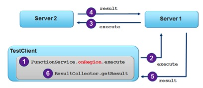

= Writing Server Side Functions

== Introduction

In this lab, you will gain hands-on experience with writing and registering  a GemFire function. A test client will invoke the function to compute a total across multiple GemFire servers.

[.thumb]

.Concepts you will gain experience with:
. Developing a GemFire function
. Register functions using XML configuration
. Execute the function on multiple servers
. Invoke the function from a client application

_Estimated completion time_: 30 minutes

== Develop the Function

Function execution allows you to move function behavior to the application member hosting the data. In this exercise, you develop a function to perform a sum over a specified field for all entries in a given region. This will offer an opportunity to explore one of the use cases for functions in GemFire.  For simplicity, this 'generic' summing function assumes that the type used for summing is a `java.lang.Float`.

To perform this task, open the `server-functions` project in your IDE.

. Open the `GenericSumFunction` class in the `io.pivotal.bookshop.buslogic` package. Notice that this class implements the `Function` interface, as well as the `Declarable` interface.

. Implement the `execute()` method as follows:

.. (`TODO-01`) Enforce that the `FunctionContext` is an instance of `RegionFunctionContext`. It's important that this be done as this function is only designed to be run via the `onRegion(..)` method calls. You might throw a `FunctionException` if this prerequisite isn't met. Assuming the `FunctionContext` argument is an instance of `RegionFunctionContext`, cast it to an instance of `RegionFunctionContext`.

.. (`TODO-02`) Use the `FunctionContext` to get the parameter passed from the client. This will represent the name of the field on the `PdxInstance` for which the summing operation will be performed.

.. (`TODO-03`) Use the `PartitionRegionHelper` class to get all the local region data. We'll later add additional configuration to ensure that the local data obtained is strictly primary region data. Also initialize an instance of `BigDecimal` as this will be used to hold the sum that will be returned by the function.

.. (`TODO-04`) Iterate over the local data, which should be a collection of `PdxInstance` objects. We'll later add configuration to enable PDX Serialization and to enforce that data read on the server side remains serialized.

.. (`TODO-05`) Use the argument provided to de-serialize (extract) the field that will be used for summing. Initially, extract an `Object`. In a successive step, make sure the field is an instance of `Float` (we are making that assumption). If it is an instance of `Float`, add this value to the current sum.

.. (`TODO-06`) Once all entries have been processed, send the final sum back to the caller. Since you will be only sending one result for this execution, make sure that you signal that this is the last result.

== Register the Function and Start Servers

You'll need to register the function you just wrote with the server cache configuration.

. (`TODO-08`) Open the `cluster/cluster.xml` file and add the necessary configuration to enable PDX Serialization using the `ReflectionBasedAutoSerializer`.

. (`TODO-09`) Add the appropriate configuration to register the function

. (`TODO-10`) Start a locator and two servers in a manner similar to what we've done in past labs, by running `gfsh run --file=serverStart.gf` from within the `cluster` folder.

. Next, execute `OrderLoader` class found in the `io.pivotal.bookshop.buslogic` package in your IDE. This will load the Order Region with data.

== Calling the Function

Finally, you will test the function using the `SummingFunctionTest` JUnit test found in `src/test/java`.

. In the next lab exercise, you will focus on the writing the code to execute the function and process the results. For now, you will just worry about executing the function and verifying the results.

. (`TODO-11`) Go ahead and run the program from the IDE. The test should pass.  If not, go back and review your implementation, and also make sure that you ran the `OrderLoader`.

. Stop the servers and locator.

Congratulations!! You have completed this lab.

