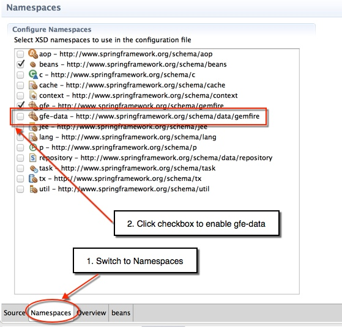

= Spring Data GemFire

== Introduction

In this lab, you will gain hands-on experience working the Spring Data GemFire project to build client-side GemFire applications. These series of steps will help you appreciate the simplicity of configuring GemFire clients using Spring.

.What you will learn
. Basic client cache configuration using Spring Data GemFire
. Configuring and using the `GemfireTemplate`
. Using the Spring Data `Repository` interface
. Registering interest using Spring Data GemFire

_Estimated completion time:_ 45 minutes

== Start the Back-End

As we've done in certain previous labs, we'll use the `server-bootstrap` module to start up a backend.

. Start the server-side processes using the `server-bootstrap` `start.sh` script (`start.bat` for Windows) inside the folder `cluster`:
+
----
cd server-bootstrap/cluster
./start.sh
----

. Next, run the gradle task 'seedRegions' to seed the regions with some data
+
----
cd server-bootstrap
gradle seedRegions
----

== Basic configuration using Spring Data GemFire

In this first section, you will get a basic configuration up and running that will include setting up a client cache and defining a client region for the `Book` region.

. (`TODO-01`) Locate and open the `spring-config.xml` file under `src/main/resources` folder. Notice that this is largely an empty file at the moment. Notice also that the Gemfire namespace has been enabled with the `gfe` prefix. Your first task is to configure the client pool that is configured to point to the locator.

. (`TODO-02`) Create a client cache definition pointing to the pool you just defined.

. (`TODO-03`) Define a client region and configure it as a `CACHING_PROXY`

. (`TODO-04`) Open the `BasicSpringClientTests.java` file under `src/test/java`. The basic structure of this test harness has already been set up.  Take a moment to get familiar with the basic way this test harness is configured using the Spring-aware integration test. Notice also how we injected the region into the harness using the `@Resource` annotation. Usually, we use the Spring specific `@Autowired` annotation but the nature of this object requires we inject it as a named bean.

. (`TODO-05`) Run the test named `simpleClientTest`. If you configured the `spring-config.xml` file properly, the test should pass.

== Using GemfireTemplate

In this next section, you will gain familiarity with the `GemfireTemplate`, one of the helper classes provided by the Spring Data GemFire project.

. (`TODO-06`) Return to the `spring-config.xml` file and add a basic bean definition to instantiate an instance of `GemfireTemplate`. You can either inject the `Book` region as a constructor argument or set it as a property on the bean.
+
TIP: You will use a basic bean definition such as <bean id="someName" class="classToInstantiate" /> where _classToInstantiate_ is the fully qualified class name.

. (`TODO-07`) Return to the `BasicSpringClientTests` class and autowire the `GemfireTemplate` you just configured into the test harness.

. (`TODO-08`) Locate the `testGemfireTemplate()` test method and add code to execute a simple query on the template. Use the `find()` method to search for books whose author is `Daisy Mae West`. Make sure to parametrize your query.
+
TIP: Note that the results returned are of type `SelectResults`, which is a GemFire collection type. You can use the `asList()` method to convert the results into simple `java.util.List` type.

. Assert that you received back a single result whose title is _A Treatise of Treatises_.

. Run the test `testGemfireTemplate()` and ensure it passes.

== Using Repositories

This section will allow you to gain familiarity with the concept of spring data Repositories.  This approach allows you to create repository-style interfaces declaratively.

. (`TODO-09`) Open the `Book` class in the `io.pivotal.bookshop.domain` package. Add the appropriate annotation to the top of the class to declare that domain object is obtained from the `Book` region.

. (`TODO-10`) Create a new interface in the `io.pivotal.bookshop.buslogic` package that will be your Repository interface. Make it extend the `GemfireRepository` base interface and set the entry type and key type appropriately for the generics part of the definition.
+
In the same interface declaration, add a `findBy` method declaration that will support finding `Book` objects by the `Author` attribute. The method should have a single argument of type `String` and should be made to return a list of `Book` objects.

. (`TODO-11`) Return to the `spring-config.xml` file and add an entry to configure scanning for repositories. In order to do this, you'll first have to enable the `gfe-data` namespace as shown below.
+
[.thumb]

. (`TODO-12`) Return to the `BasicSpringClientTests` class and add another declaration near the top of the class to autowire the newly created `Repository` interface.

. (`TODO-13`) Locate the `testGemfireRepositories()` method and add the necessary code to correctly invoke the method on the repository instance.

. Here too, assert that you get only one matching entry, and that the entry's title is `A Treatise of Treatises`.

== Configuring Listeners and registering interest

In this final section, you will explore the capabilities of Spring Data GemFire to simplify configuration of CacheListeners and to enable clients to register interest in certain keys. Since you've already performed most of the basic coding in a prior lab, all you'll do in this lab is add the appropriate Spring Data GemFire configurations and re-run the `ClientConsumer` and `ClientWorker` to test the behavior out.

. (`TODO-14`) Open the `spring-config.xml` file again and locate the pool configuration. Add an attribute to enable client subscriptions.

. (`TODO-15`) Locate the client-region definition you created in `TODO-03`. Add an entry inside this region definition to configure a `CacheListener` for the region. Have it point to the `LoggingCacheListener` that is found in the `io.pivotal.bookshop.buslogic` package.

. (`TODO-16`) Finally, add another entry inside the client-region definition to register interest in the key `999`.
+
TIP: Note that this key is of type `java.util.Long` so you'll need to configure the key correspondingly when creating the interest registration.  Also, you can use the Spring `<value>` element to specify that value.

. (`TODO-18`) Open the `ClientConsumer` class and take a look at the functionality implemented there. As you can see, all the class does is initialize the Spring `ApplicationContext` and then wait for the `ClientWorker` to perform some operations on the cache. Our `LoggingCacheListener` will report when an entry having the key `999` gets created or deleted. Go ahead and run `ClientConsumer` now.

. (`TODO-19`) Locate the `ClientWorker` class. This is basically the same class that was used in the events lab to create a new `Book` entry with the key `999`. Run it. The program will start by displaying some basic information and then pause waiting for user input to continue.
+
Place your cursor in the console area and hit enter. The program will now proceed to insert an entry with key `999` and then remove it before terminating.  Switch consoles back to the `ClientConsumer` and observe the `LoggingCacheListener` report that the entry was created and then deleted.

. Make sure that both the `ClientWorker` and `ClientConsumer` have terminated.

Congratulations! You have completed this lab.

